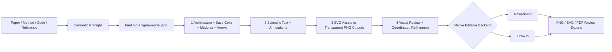

# Draw in Method

> Semantic-first, native-editable academic figures for papers, methods, and technical systems.
>
> 从论文、方法描述、代码或参考图出发，先理解科学语义，再生成原生可编辑、可验证、适合论文发表的架构图与方法图。

`draw-in-method` 是一个面向 Codex 的学术制图 skill，主要服务于机器学习、人工智能、计算机视觉、多模态学习、信号处理和其他需要复杂方法图的研究场景。它不仅负责“把框画出来”，还会先分析图中真正的实体、关系、阶段、创新点和不确定信息，再将同一份语义模型转换为原生可编辑的 PowerPoint 或 Draw.io 图。

它特别适合以下任务：

- 根据论文 Method、摘要、伪代码或项目代码绘制整体架构图；
- 展开 Attention、Q/K/V、特征交互、路由、记忆库、损失或多分支模块；
- 根据参考截图复现论文图，同时保留可编辑性；
- 把已有草图、白板图或位图重构为清晰的论文级矢量图；
- 生成可在 PowerPoint 中继续修改的原生 `.pptx`；
- 生成可在 diagrams.net / Draw.io 中继续修改的 `.drawio`；
- 为物理对象、设备、输入场景和输出应用接入 Iconfont、Flaticon、Iconify 或本地 SVG；
- 通过语义校验、溢出检查和截图复查，减少错箭头、遮挡、假公式和无意义装饰。

当前仓库处于个人迭代阶段，目标不是做通用商业信息图，而是形成一套可持续优化的“论文方法图工程流程”。

---

## 目录

- [核心能力](#核心能力)
- [为什么不是普通的自动画图工具](#为什么不是普通的自动画图工具)
- [输出格式与可编辑性](#输出格式与可编辑性)
- [安装](#安装)
- [快速开始](#快速开始)
- [工作流程](#工作流程)
- [架构图模式](#架构图模式)
- [2.5D 模块与层叠张量](#25d-模块与层叠张量)
- [矢量图标与资产检索](#矢量图标与资产检索)
- [证据文件与语义模型](#证据文件与语义模型)
- [命令行工具](#命令行工具)
- [质量门槛](#质量门槛)
- [项目结构](#项目结构)
- [开发与测试](#开发与测试)
- [能力边界](#能力边界)
- [路线图](#路线图)
- [许可与第三方说明](#许可与第三方说明)

---

## 核心能力

### 1. 语义优先，而不是形状优先

绘图之前先建立科学语义：

- 输入是什么，模态和形状是什么；
- 哪些预处理对理解方法真正重要；
- 模型由哪些阶段组成，顺序和依赖关系是什么；
- 哪些模块是已有组件，哪些是论文提出的贡献；
- 哪些分支只在训练阶段存在；
- 哪些关系是数据流、控制流、反馈、更新或注释；
- 哪些公式、维度或标签有来源，哪些内容无法从参考图中可靠辨认。

所有重要节点和边首先进入 `figure-model.json`，绘图后端不能反过来决定科学含义。完整规则见 [semantic-first-workflow.md](references/semantic-first-workflow.md)。

### 2. 原生可编辑 PowerPoint

生成的 `.pptx` 以 PowerPoint 原生对象为主：

- 文字保持为可编辑文本；
- 模块保持为独立形状；
- 2.5D 计算块可由独立的正面、顶面和侧面构成，层叠张量可由多张薄棱柱构成；
- 数据流保持为连接符；
- 重复模块可以作为逻辑组移动；
- 输入图片、热力图和真实数据仅在其确实代表数据时使用栅格图；
- 选中的 SVG 图标作为独立矢量对象嵌入，而不是把整张图压成一张图片。

PowerPoint 特定要求见 [pptx-authoring.md](references/pptx-authoring.md)。

### 3. 原生可编辑 Draw.io

Draw.io 后端生成可维护的 XML：

- 使用稳定的对象 ID；
- 使用明确的坐标、容器、连接点和箭头；
- 支持本地 SVG 嵌入，最终图不依赖运行时 CDN；
- 支持结构校验、视觉质量检查和浏览器预览；
- 适合版本控制、逐对象修改和 XML 级审查。

### 4. 参考图理解与复现

参考图复现不是简单描边。skill 会分开处理：

- **内容证据**：模块名称、阶段顺序、公式、张量、箭头方向；
- **结构证据**：分组、分支、汇合、重复模块和阅读顺序；
- **风格证据**：字体、字号、色板、箭头形态、框线层级、2.5D 深度、圆角、密度和留白；
- **布局证据**：区域比例、基线、模块尺寸和连接通道；
- **不确定证据**：模糊文字、无法确认的公式或可能被遮挡的边。

无法确认的内容会进入不确定性记录，不会为了“看起来像论文”而被虚构。完整协议见 [reference-replication-protocol.md](references/reference-replication-protocol.md)。

### 5. 搜索优先的矢量资产策略

对于传感器、设备、人物、器官、实验装置、应用场景和其他真实对象，默认采用 **Flaticon / 阿里巴巴 Iconfont 外部矢量优先**：先按规范名称检索并下载真实 SVG，而不是直接用几个基础形状拼一个低质量图标。已经下载并登记完整来源的 Flaticon/Iconfont SVG 可以复用；没有精准匹配时才重新到提供商页面筛选候选。

当前工具链支持：

- 本地 SVG；
- Iconfont / 阿里巴巴矢量图标库导出的 SVG 或 symbol bundle；
- Flaticon 下载的 SVG 或 ZIP；
- Iconify / Iconify 风格本地资产；
- 本地注册表检索、清洗、配色映射、自包含嵌入和来源记录。

具体说明见 [vector-assets.md](references/vector-assets.md)。

### 6. 可执行的质量验证

项目包含多种验证脚本，可检查：

- 语义模型中的未知节点或错误边；
- 未完成的命名资产检索；
- Draw.io XML 结构；
- 文本溢出和模块重叠；
- 箭头与模块碰撞；
- 孤立标签、间距波动和颜色散乱；
- 复现任务所需的证据文件、截图记录和自评分。

---

## 为什么不是普通的自动画图工具

普通自动制图常见的问题是：

- 根据几个关键词直接堆模块；
- 用随机颜色制造“复杂感”；
- 箭头穿过文字或连接到错误对象；
- 把参考图中的 token、矩阵和立方体当成装饰复制；
- 无法解释每个图形元素代表什么；
- 输出只有 PNG，看起来像图，但无法继续编辑；
- 为了塞下内容不断缩小字体；
- 从模糊截图中猜测不存在的公式和维度。

`draw-in-method` 的基本原则是：

> Every visible element must have a named scientific meaning.
>
> 每一个可见元素都必须对应一个可以说清楚的科学含义。

如果一个矩阵、token 条、颜色、图标或箭头无法回答“它代表什么”，就应当删除、改成明确标签，或记录为尚未解决的问题。

---

## 输出格式与可编辑性

| 输出 | 主要用途 | 可编辑性 | 说明 |
|---|---|---|---|
| `.pptx` | PowerPoint 修改、汇报、论文图继续排版 | 原生文本、形状、连接符和分组可编辑 | 默认不会用一张全页图片冒充可编辑 PPT |
| `.drawio` | diagrams.net 编辑、XML 版本控制 | 原生节点、容器、连接符和嵌入 SVG 可编辑 | 适合精细连线和结构维护 |
| `.png` | 快速预览、截图审查 | 不可编辑 | 只作为派生预览，不是源文件 |
| `.svg` | 论文排版、矢量导出 | 依导出方式而定 | 可以保持分辨率无关，但不等同于原生 PPT 对象 |
| `.pdf` | 投稿预览、打印和归档 | 通常作为交付导出物 | 必须检查字体、公式和裁切 |
| `figure-model.json` | 格式中立的科学语义 | 文本可编辑 | PPTX 和 Draw.io 可从同一语义模型构建 |

需要同时输出 PPTX 与 Draw.io 时，两个后端应共同读取 `figure-model.json`；不应把一个后端的整张截图嵌入另一个后端后声称“两种格式都可编辑”。

---

## 安装

### 前置条件

- Codex 能够扫描个人 skill 目录；
- Python 3.10+，用于本仓库的工具脚本；
- 生成 PowerPoint 时，需要 Codex 的 Presentations 运行时；
- 生成或预览 Draw.io 时，建议安装 diagrams.net 桌面版或可用的 Draw.io CLI；
- 从私有仓库克隆时，需要已经登录的 GitHub CLI 或其他有权限的 Git 凭据。

### 从私有 GitHub 仓库安装

Windows PowerShell：

```powershell
gh auth login
gh repo clone Haohaha-11/draw-in-method "$env:USERPROFILE\.codex\skills\draw-in-method"
```

macOS / Linux：

```bash
gh auth login
gh repo clone Haohaha-11/draw-in-method "${CODEX_HOME:-$HOME/.codex}/skills/draw-in-method"
```

如果已经安装，使用 fast-forward 更新：

```powershell
git -C "$env:USERPROFILE\.codex\skills\draw-in-method" pull --ff-only
```

安装或更新后，重新打开一个 Codex 任务，使 skill 发现缓存重新加载。成功加载后，可用名称为：

```text
$draw-in-method
```

---

## 快速开始

### 示例一：从方法描述生成可编辑 PPTX

```text
使用 $draw-in-method 理解下面的方法，并生成原生可编辑 PowerPoint 架构图。

图形类型：整体架构 + 一个核心模块细节面板。
输入：多通道时间序列信号。
主要流程：时频编码 → 跨通道交互 → 多尺度聚合 → 预测头。
核心创新：自适应跨通道交互模块。
输出：分类概率。

要求：
1. 先给出语义骨架和箭头关系；
2. 不要添加大标题、页码和底部说明；
3. 使用紧凑论文图样式；
4. 文字、模块和箭头必须在 PPT 中分别可编辑；
5. 交付 .pptx 和 PNG 预览。
```

### 示例二：复现参考截图

```text
使用 $draw-in-method 复现这张论文方法图，输出原生可编辑 PPTX。

先理解图像中的模块、阶段、分组、主数据流和控制流，再开始绘图。
保留参考图的字体层级、低饱和度配色、模块密度和箭头语法。
模糊的公式不要猜，记录到 uncertainty ledger。
现实对象图标先按名称搜索并下载 Flaticon / 阿里巴巴 Iconfont SVG；模型计算使用原生矢量模块。
```

### 示例三：只做第 1 步架构

```text
使用 $draw-in-method 为下面的方法完成语义准备，并建立第 1 步架构。

这一步只输出：
- figure-model.json；
- 画布、底色和语义区域；
- 统一尺寸族的模块组合；
- 端口、箭头通道以及分支、汇合、跳连和反馈；
- 分检查点的架构预览和 production-review.md。

暂时不要添加正式文字批注、图标、插画、阴影或装饰。
等我确认模块大小和箭头逻辑后再进入第 2 步。
```

### English example

```text
Use $draw-in-method to understand this method and create a native editable PPTX figure.

Complete semantic preflight first, then build Stage 1 with restrained base fills,
consistent module-size families, explicit ports, and reviewed connector lanes.
Use one dominant left-to-right data path and a separate module-detail panel only
for the proposed mechanism. Add final scientific labels and assets only after the
architecture is approved.
Do not invent unreadable equations or flatten the final slide into a full-canvas image.
Deliver the editable PPTX and a rendered PNG preview.
```

---

## 工作流程



### Stage 0：语义准备，不计入四个生图步骤

先创建 `brief.md` 和 `figure-model.json`，明确：

- 节点、分组和阅读顺序；
- 数据流、控制流、反馈、更新和注释边；
- 创新模块、已有模块、训练分支和推理路径；
- 需要按名称检索的物理或场景资产；
- 来源不足或无法辨认的信息。

在语义模型通过验证之前，不开始正式几何绘制。

### 第 1 步：架构、底色、模块组合和箭头

这一步建立整张图的视觉骨架，并边添加边 review：

- **1A 画布与区域**：确定画布比例、外边距、面板分区、阅读方向和低饱和度底色；
- **1B 模块组合**：建立普通模块、小算子、创新模块和容器的尺寸族，统一重复模块；把每个可见家族分类为 flat、framed、2.5D block、layered tensor、data frame 或 semantic container，并记录参考数量、计划数量、面／板片结构、挤出向量、镜像规则和连接目标；
- **1C 主连接骨架**：确定主数据流基线、端口、箭头方向和专用通道；
- **1D 复杂关系**：补充分支、汇合、跳连、反馈、控制和更新关系，并检查交叉与遮挡；
- 输入、输出、控制和辅助端口；
- 必要的占位标签，但不加入完整讲解和正式资产。

底色在这一步确定，因为它会直接影响分组、视觉重量和模块组合判断。每个检查点都可以渲染预览；在模块大小和箭头逻辑通过之前，不进入下一步。

1A、1B、1C、1D 必须是四个真实的中间快照：每张只包含截至当前检查点已经加入的内容，不能先画完 Stage 1 再事后解释为“分步”。`STAGE 1A` 之类的制作标签写在文件名和 review 记录中，不写进论文图画布。

### 第 2 步：文字、批注和讲解

加入：

- 模块名称；
- Stage / Group 标题；
- 张量形状；
- Q/K/V、操作顺序和关键公式；
- 必要图例；
- `(a) Overall Architecture`、`(b) Proposed Module` 等面板标签。

优先删掉冗余文字、调整模块或拆分面板，不通过无限缩小字号解决拥挤。

### 第 3 步：命名矢量资产或透明背景生成资产

- 现实对象优先按规范名称及中英文别名检索已有 SVG；
- 来源优先级为：已缓存且来源完整的 Flaticon/Iconfont SVG → Flaticon 与阿里巴巴 Iconfont 可见页面检索和候选对比 → 其他获授权的外部库 → 原生/基础图形回退；
- 搜索结果缩略图和网页链接不能代替真实下载的 SVG；
- 模型计算使用原生可编辑形状；
- 所有选用或放弃的资产记录在 `asset-ledger.md`；
- 最终资产嵌入本地文件，不保留运行时 CDN 依赖；
- 没有合适图标且确实需要定制场景时，可以用 ImageGen 生成透明背景 PNG cutout。

ImageGen 生成的透明 PNG 是位图素材，不是真正的 SVG 矢量图标。需要可缩放、可改路径的矢量资产时，应继续使用命名检索得到的 SVG，或采用另行确认的矢量化流程。

### 第 4 步：完整视觉 Review 和协调微调

- 渲染全画布预览；
- 检查文字、公式、箭头、模块比例、重叠、裁切和字体替换；
- 检查图标位置、大小、视觉重量和风格一致性；
- 微调对齐、间距、字号、色彩权重和连接符净空；
- 验证代表性文字、模块、连接符和 SVG 可以独立选择；
- 高保真任务执行多轮截图 → 缺陷清单 → 修复 → 重渲染；
- 如果发现结构性问题，返回第 1 步修正，不用装饰掩盖错误。

四步法的检查点、批准条件、交付证据和自主执行规则见 [staged-drawing-workflow.md](references/staged-drawing-workflow.md)。

---

## 架构图模式

神经网络架构、系统流水线、编码器—解码器、多分支融合和模块原理图会启用专门的 architecture figure mode。完整规范见 [architecture-figure-contract.md](references/architecture-figure-contract.md)。

### 默认禁止的演示稿元素

除非用户明确要求汇报型页面，否则不添加：

- 巨型 slide title；
- 副标题和眉题；
- 页码；
- 底部大段 takeaway；
- “Native Editable”等状态徽章；
- 巨型圆角卡片、阴影、渐变或玻璃效果；
- 只为填空而出现的图标、矩阵和 token 条。

架构本身通常占画布的 85%–95%。

### 字体

- 英文默认：Times New Roman；兼容性或公式覆盖需要时使用 Cambria；
- 中文默认：SimSun；不可用时使用 Noto Serif CJK SC；
- 数学变量、张量符号和下标使用斜体；
- 一张图保持一个字体家族；
- 必要标注不应小于约 9 px 的 1600 × 900 等效字号。

### 架构图色板

以下色板来自当前约束，但单张图不应全部使用：

| 语义角色 | 颜色 | 典型用途 |
|---|---|---|
| 标准特征模块 | `#B4C6E7` | Encoder、Transformer、基础网络块 |
| 次级分支 | `#D3D3FF` | 文本分支、辅助路径 |
| 重建 / 上采样 | `#ADD7AC` | Decoder、Fusion、Upsample |
| 退化 / 下采样 | `#E8B593` | Degradation、Downsample |
| 上下文 / 输出 | `#FAE4D5` | 输出头、上下文区域 |
| 暖色辅助模块 | `#FCDAB1` | Prompt、小型辅助操作 |
| 中性面板 | `#FAF6E7` | Group 背景、模块内部 |
| Attention / Query | `#A2B6FA` | Query、Attention、选中特征 |
| Proposed / Learnable | `#EA717A` | 创新模块、可学习机制 |
| 创新区域浅背景 | `#F7E7EA` | Proposed module 外层区域 |

普通描边和主箭头使用 `#1F1F1F` 或 `#30343B`。`#EA717A` 通常只用于一类真正的创新机制或被保留的重要证据。

### 模块尺度基准

在 1600 × 900 画布上：

| 对象 | 典型尺寸 |
|---|---|
| 普通模块 | 105–180 × 48–82 px |
| 小型算子 | 48–92 × 28–50 px |
| 核心创新模块 | 140–230 × 64–110 px |
| Stage / Group | 280–680 × 150–430 px |
| Token / Tensor 单元 | 14–24 px 方块 |

这些数值是起点，不是绝对模板。真正约束是：相同模块保持一致，辅助模块不应比创新模块更抢眼，图在论文目标尺寸下仍能阅读。

---

## 2.5D 模块与层叠张量

PowerPoint 确实内置了 Cube、Bevel 等 AutoShape，也可以对普通形状应用“三维格式”和“三维旋转”，还可以插入真正的 3D 模型。但这些能力解决的是不同问题：

| 模式 | 适用场景 | 默认限制 |
|---|---|---|
| Cube / Bevel 快速模式 | 草图、简单标准块、无需逐面控制 | 一个对象、一个主要填充逻辑，逐面配色和端口控制有限 |
| PowerPoint 三维效果 | 参考图本身具有材质、光照和三维旋转 | 正面／顶面／侧面不是独立对象，跨渲染器结果可能变化 |
| 真实 3D 模型 | 设备、器官、机械结构等真实上下文 | 不适合抽象编码器、Transformer、张量和融合模块 |
| 独立面组合 | 投稿级架构图和高保真参考复现 | 对象较多，但深度、颜色、镜像、边框和端口完全可控 |

相关微软官方能力入口：[Cube / Bevel AutoShape 类型](https://learn.microsoft.com/en-us/office/vba/api/office.msoautoshapetype)、[形状的 Bevel 与 3-D Rotation 效果](https://support.microsoft.com/en-US/Office/graphics-visuals/add-a-fill-or-effect-to-a-shape-or-text-box)、[插入和旋转 3D 模型](https://support.microsoft.com/en-US/Office/graphics-visuals/get-creative-with-3d-models)。

高保真模式默认采用独立面组合：

```text
正面 front face
+ 较浅顶面 top face
+ 较深侧面 side face
+ 正面端口或透明语义连接包络
```

### 深度家族覆盖审计

不能因为一个主要立方体画对了，就认为整张图的 2.5D 已经完成。Stage 1B 必须建立深度家族清单：

| 字段 | 例子 |
|---|---|
| family id | `encoder-block`、`multiscale-feature-stack`、`tim-side-tensor` |
| form class | 2.5D block、layered tensor、flat control |
| reference / planned count | 参考图和当前图的实例数量 |
| plate / face grammar | 每组板片数，以及 front/top/side 是否可见 |
| depth token | `(dx, dy)`、斜率、顶面与侧面配色 |
| mirror rule | 无镜像、左右镜像或分阶段透视 |
| connector target | 正面端口或整组透明包络 |

例如一张参考图同时包含 6 个主计算块、3 组多尺度特征和 12 组分支张量时，只完成 6 个主计算块不算通过；其余家族必须匹配、标记不确定，或说明为何有意简化。

### 三种可编辑 2.5D 配方

1. **主计算块**：前矩形承载文字，顶面和侧面共享一个挤出向量；重复模块的尺寸、面色、线宽和对象名一致。
2. **多尺度特征堆叠**：每一张可见特征板都是薄棱柱，不是简单错位的平面多边形；其深度小于主计算块。
3. **左右分支张量**：使用倾斜前平面和明确的顶面／侧面；右侧对象需要同时镜像斜率、挤出方向和可见侧面，而不是只把位置反过来。

### 连接与对象命名

- 箭头不能连接装饰性顶面或侧面；
- 主模块使用明确的 front-face port；
- 层叠张量使用覆盖整组的透明 connector envelope，让上下左右关系连接到语义整体；
- 建议对象命名采用 `family-instance-plate-02-front-face`、`...-top-face`、`...-side-face`；
- 绘制顺序为后层到前层；单张板片内部先画顶面／侧面，再画正面；
- 最终检查 `instances × plates × faces` 和 connector envelope 数量，避免只看截图而漏掉被平面化的家族。

完整实现与验收规则见 [shape-depth-and-frame-system.md](references/shape-depth-and-frame-system.md)。

### 箭头语法

每条边应记录源节点、源端口、目标节点、目标端口、关系类型、通道、标签和箭头要求。

| 端口 | 默认含义 |
|---|---|
| 左侧 | 主要输入 |
| 右侧 | 主要输出 |
| 顶部 | 文本、Prompt、全局条件或控制 |
| 底部 | 辅助分支、Loss、参数更新或反馈 |

路由原则：

- 主数据流尽量保持一条水平基线；
- 普通边零折或一折；
- Skip、Feedback 或长控制边最多两折；
- 箭头不能穿过文字、模块或无关区域；
- 并行通道必须保持稳定间距；
- 四条以上扇入或扇出时使用总线、主干或明确汇合点；
- 箭头连接语义端口，不连接标题条或装饰对象；
- 先审核连接符骨架，再添加密集内容。

矢量库箭头采用“三层分离”：

1. 原生连接器负责真实拓扑、端口和路由；
2. 同一矢量家族的 SVG marker 负责更漂亮、统一的箭头视觉；
3. funnel、filter、merge、zoom 等 SVG 是独立操作节点，不是连接线。

可见箭头 marker 和 funnel/filter/merge/zoom 等操作符优先从同一套 Flaticon 或阿里巴巴 Iconfont 图标家族下载。Skill 内置的 Lucide SVG 只作为下载受阻、没有合适候选或用户明确选择极简风格时的回退；必须记录检索、来源和许可状态。禁止再次把一个巨大的 chevron 同时当作“流程箭头”和“Top-m 剪枝模块”。

---

## 矢量图标与资产检索

### 检索优先级

1. 本地注册表中语义准确、风格匹配且来源完整的 Flaticon / Iconfont 下载资产；
2. 通过 Flaticon 与阿里巴巴 Iconfont 的正常可见界面按中英文规范名称检索，比较 2–6 个候选，并下载选中的真实 SVG；
3. 两个首选库都没有合适结果时，再考虑 Iconify、其他获授权的外部库或专业原生形状库；
4. Lucide、PowerPoint / Draw.io 基础图形只作为明确记录的回退；
5. 没有合适外部资产、用户明确要求自定义，或对象属于论文特有抽象机制时，才从基础矢量图元构造，且不得静默替换。

这里的“优先”是来源优先级，不要求每次重复下载同一个图标。已经缓存的外部资产必须保留 provider、作者/图标集、资产页 URL、许可状态和本地 SVG 路径；没有这些来源信息的自绘图标不能冒充 Flaticon/Iconfont 资产。

ImageGen 适合制作带透明背景的定制位图 cutout 或构图参考，但其输出不应被标注为 SVG 或“可编辑矢量”。真正的矢量资产仍以 SVG 检索、导入和清洗流程为准。

### 为什么不默认自己拼图标

现实对象通常具有明确的视觉比例、轮廓和领域特征。简单矩形、圆形和折线可以表达抽象计算，但很难稳定表达传感器、显微镜、病理切片、可穿戴设备或复杂实验装置。搜索优先可以提高：

- 语义匹配度；
- 轮廓质量；
- 风格一致性；
- 可缩放性；
- 来源和授权可追踪性。

### 本地导入示例

查看矢量资产工具帮助：

```powershell
python scripts/vector_assets.py --help
```

典型工作流包括导入 SVG、解析 Iconfont symbol bundle、处理 Flaticon ZIP、清理脚本和外部依赖、映射颜色、写入 `data/icon-registry.json`，然后生成可嵌入 Draw.io 或 PPTX 的本地资产。

注意：skill 会记录来源信息，但不会自动替用户判断所有第三方资产的最终出版许可。使用 Iconfont、Flaticon 或其他提供商资产时，应根据具体图标、账户计划、作者要求和发布场景检查授权。

---

## 证据文件与语义模型

对于复杂、需要复现或准备投稿的图，建议维护以下文件：

| 文件 | 作用 |
|---|---|
| `brief.md` | 用户目标、受众、必须表达和明确排除的内容 |
| `figure-model.json` | 节点、边、分组、阅读顺序、资产需求和不确定性 |
| `visual-spec.md` | 字体、色板、尺寸、线宽、圆角和视觉层级 |
| `layout-grid.md` | 画布、区域框、基线、重复模块尺寸和连接通道 |
| `asset-ledger.md` | 命名检索、候选资产、来源、选择理由和回退原因 |
| `production-review.md` | 四个生产步骤及第 1 步子检查点的预览、发现、修复和批准记录 |
| `defect-log.md` | 截图复查、缺陷、修复、红队检查和自评分 |

初始化一个非破坏性的图形工作区：

```powershell
python scripts/init_figure_workspace.py <work-dir> --title "Method Overview"
```

脚本只创建缺失文件，不覆盖已经存在的 brief、视觉规范或缺陷记录。

### `figure-model.json` 最小示例

```json
{
  "schema_version": "1.0",
  "title": "Method overview",
  "primary_output": "pptx",
  "reading_order": "left-to-right",
  "nodes": [
    {
      "id": "input_signal",
      "label": "Input signal",
      "role": "input",
      "kind": "physical",
      "group": "overview",
      "asset_strategy": "raster-context"
    },
    {
      "id": "proposed_block",
      "label": "Adaptive Interaction Block",
      "role": "proposed",
      "kind": "module",
      "group": "overview"
    }
  ],
  "edges": [
    {
      "id": "input_to_proposed",
      "source": "input_signal",
      "target": "proposed_block",
      "relation": "data",
      "label": ""
    }
  ],
  "groups": [
    {
      "id": "overview",
      "label": "Overall Architecture",
      "members": ["input_signal", "proposed_block"]
    }
  ],
  "asset_queries": [],
  "uncertainties": []
}
```

---

## 命令行工具

以下命令默认在仓库根目录运行。

### 验证语义模型

```powershell
python scripts/validate_figure_model.py <work-dir>\figure-model.json
```

检查未知端点、重复 ID、缺失字段和缺少命名计划的资产。第 3 步完成后，再执行严格资产门槛：

```powershell
python scripts/validate_figure_model.py <work-dir>\figure-model.json --require-assets-resolved
```

严格模式要求每个资产检索都已经选定本地资产，或记录具体的回退原因。

### 验证 Draw.io

```powershell
python scripts/validate_visual_quality.py <figure>.drawio
python scripts/validate_drawio.py <figure>.drawio
```

第一项关注视觉质量和布局风险，第二项关注 Draw.io XML 结构。交付前应解决全部 `FAIL`，并逐项审查 warning。

### 验证复现证据

```powershell
python scripts/validate_replication_artifacts.py <work-dir>
python scripts/validate_replication_artifacts.py <work-dir> --require-screenshot-review
```

### 启动本地 Draw.io 预览

```powershell
python scripts/serve_drawio_preview.py <figure>.drawio --port 8765
```

### 生成浏览器回退 URL

```powershell
python scripts/encode_drawio_url.py <figure>.drawio
```

### 修复 Draw.io PNG 导出尾部

```powershell
python scripts/repair_png.py <figure>.drawio.png
```

### 搜索本地 Draw.io 形状

```powershell
python scripts/shapesearch.py "sensor"
```

### 分布连接端口

```powershell
python scripts/edgeports.py <figure>.drawio
```

更多脚本说明可从各脚本的 `--help` 获取。

---

## 质量门槛

### 语义门槛

- 每个必须出现的节点都有稳定 ID；
- 每条边都有明确源和目标；
- 创新点、已有组件、训练分支和推理路径没有混淆；
- 无来源的维度、指标、损失和公式不会被添加；
- 需要现实对象图标时，命名检索已经完成或记录了可靠的回退原因。

### 视觉门槛

- 论文目标尺寸下仍能阅读；
- 没有非预期重叠、裁切和文本溢出；
- 箭头不会穿过文字或模块；
- 箭头方向、扇入扇出和汇合点没有歧义；
- 相同模块使用相同尺寸和样式；
- 参考图中的 flat、framed、2.5D 和 layered 家族已经逐类覆盖，数量差异都有说明；
- 2.5D 的顶面、侧面、镜像方向和深度层级在独立 PowerPoint 渲染中仍然可见；
- 颜色具有稳定语义，而不是随机装饰；
- 图例不占用主数据流；
- 画布贴合构图，没有大面积无意义留白。

### 可编辑性门槛

PowerPoint 中至少应能分别选择和修改：

- 一段科学文字；
- 一个普通模块；
- 一个创新模块；
- 一个 2.5D 主模块的正面、顶面和侧面；
- 一张 layered tensor 薄棱柱及其镜像对应项；
- 一个透明语义 connector envelope；
- 一条主数据连接符；
- 一个重复模块组；
- 一个独立矢量图标。

Draw.io 中应能分别编辑节点、容器、连接符、标签和嵌入资产。

### 渲染门槛

- 所有最终页面都已经渲染；
- 检查的是全画布截图，不是缩得很小的编辑器或浏览器截图；
- 公式在导出物中显示为公式，而不是 LaTeX 源字符串；
- 最新一次验证发生在最后一次写入和渲染之后；
- 高保真或投稿关键图完成多轮截图驱动修复。

完整通用规则见 [general-quality-contract.md](references/general-quality-contract.md)。

---

## 项目结构

```text
draw-in-method/
├── SKILL.md
├── README.md
├── agents/
│   └── openai.yaml
├── references/
│   ├── architecture-figure-contract.md
│   ├── figure-contract.md
│   ├── general-quality-contract.md
│   ├── pptx-authoring.md
│   ├── reference-replication-protocol.md
│   ├── semantic-first-workflow.md
│   ├── shape-depth-and-frame-system.md
│   ├── staged-drawing-workflow.md
│   ├── contextual-asset-strategy.md
│   ├── vector-assets.md
│   ├── xml-authoring.md
│   └── ...
├── scripts/
│   ├── init_figure_workspace.py
│   ├── validate_figure_model.py
│   ├── validate_replication_artifacts.py
│   ├── validate_visual_quality.py
│   ├── validate_drawio.py
│   ├── vector_assets.py
│   ├── serve_drawio_preview.py
│   └── ...
├── data/
│   ├── icon-registry.json
│   ├── lobe-icons.json
│   └── shape-index.json.gz
├── assets/
│   └── vector-arrows/       # bundled Lucide arrow/operator SVG family
└── tests/
    └── test_vector_assets.py
```

重要入口：

- [SKILL.md](SKILL.md)：Codex 实际加载的核心决策和工作流；
- [architecture-figure-contract.md](references/architecture-figure-contract.md)：架构图字体、色板、尺寸和箭头合同；
- [arrow-system.md](references/arrow-system.md)：原生连接器、矢量箭头 marker 与操作符图标的三层语法；
- [shape-depth-and-frame-system.md](references/shape-depth-and-frame-system.md)：PowerPoint 2.5D 选择层级、独立面构造、层叠张量、镜像和框线系统；
- [contextual-asset-strategy.md](references/contextual-asset-strategy.md)：图标必要性、视觉家族锁定和结构／外观边界；
- [staged-drawing-workflow.md](references/staged-drawing-workflow.md)：四步生产流程、增量 review 检查点和批准门槛；
- [pptx-authoring.md](references/pptx-authoring.md)：PowerPoint 原生可编辑后端；
- [semantic-first-workflow.md](references/semantic-first-workflow.md)：语义图和不确定性处理；
- [vector-assets.md](references/vector-assets.md)：Iconfont、Flaticon、Iconify 和本地 SVG；
- [reference-replication-protocol.md](references/reference-replication-protocol.md)：参考图复现和截图证据；
- [THIRD_PARTY_NOTICES.md](references/THIRD_PARTY_NOTICES.md)：第三方说明。

---

## 开发与测试

### Skill 结构校验

如果本机包含 Codex 的 `skill-creator`：

```powershell
python <skill-creator-dir>\scripts\quick_validate.py .
```

### 单元测试

Windows 中文环境建议显式启用 UTF-8，使测试启动的子 Python 进程也使用 UTF-8：

```powershell
$env:PYTHONUTF8 = "1"
python -X utf8 -B -m unittest discover -s tests -p "test_*.py" -v
```

macOS / Linux：

```bash
PYTHONUTF8=1 python -X utf8 -B -m unittest discover -s tests -p 'test_*.py' -v
```

当前测试覆盖：

- 语义准备允许仅规划资产，而第 3 步严格门槛会拒绝未解决资产；
- Flaticon ZIP 中多色 SVG 的保留；
- Iconfont symbol bundle 解析；
- 本地 SVG 导入、搜索、嵌入和验证。

### 提交前建议

```powershell
python <skill-creator-dir>\scripts\quick_validate.py .
$env:PYTHONUTF8 = "1"
python -X utf8 -B -m unittest discover -s tests -p "test_*.py" -v
git status --short
```

---

## 能力边界

### 不会把模糊内容当成事实

参考截图中无法辨认的公式、数字、维度和模块名称不会被静默猜测。它们会被简化、标记为不确定，或等待用户补充论文原文。

### 不把复杂等同于专业

更多模块、颜色、token 和矩阵不一定更专业。skill 会优先删除没有明确含义的视觉元素。

### 不保证第三方图标自动获得出版许可

资产工具负责清理、记录和嵌入，但具体资产能否用于论文、商业项目或公开发布，仍取决于提供商、作者和账户许可。

### SVG 的“可编辑”具有层级

嵌入 PowerPoint 的 SVG 通常可以独立移动、缩放和整体着色，但不同 PowerPoint 版本未必允许直接编辑其每一条内部路径。需要路径级编辑时，应使用原生形状或经过用户确认的形状转换流程。

### 栅格图只用于真实数据或上下文

输入照片、显微图、热力图和实验结果可以是栅格图；模型架构本身不应被压成一张全页位图。

### Image generation 不是科学来源

图像生成可以用于探索构图或生成真实输入场景素材，但不能替代论文提供的科学结构、公式、数据和结论。

---

## 路线图

当前计划继续优化：

- [x] 四步生产流程、增量 review 检查点和用户确认记录规范；
- [x] PowerPoint 2.5D 选择层级、深度家族覆盖审计、层叠张量与连接包络规则；
- [ ] 自动导出并归档每个 PPTX 阶段的中间预览；
- [ ] 连接符通道自动规划、端口分配和交叉最小化；
- [ ] 对 PowerPoint 原生对象的更细粒度可编辑性检查；
- [ ] 更强的公式渲染、字体回退和跨平台一致性；
- [ ] Iconfont、Flaticon 和本地资产注册表的统一检索体验；
- [ ] 可复用的论文架构布局模板与几何回归测试；
- [ ] 基于参考图的字体、模块尺寸和色板自动测量辅助；
- [ ] 更系统的论文双栏尺寸可读性评分；
- [ ] 为典型架构、模块细节和多面板图增加经过验证的示例。

路线图表示后续方向，不代表当前版本已经实现这些能力。

---

## 许可与第三方说明

当前仓库没有附带对外公开复用的顶层许可证。作为私有个人仓库使用时，请不要默认将仓库整体视为开源许可内容。

部分数据索引或工具代码可能包含独立来源和许可说明，详见：

- [references/THIRD_PARTY_NOTICES.md](references/THIRD_PARTY_NOTICES.md)
- [data/SHAPE-INDEX-NOTICE.md](data/SHAPE-INDEX-NOTICE.md)

从 Iconfont、Flaticon、Iconify 或其他提供商导入的具体资产，应单独记录来源、作者和许可状态。

---

## English summary

`draw-in-method` is a Codex skill for understanding, designing, and replicating camera-ready academic figures. It uses a semantic-first figure model, explicit connector semantics, depth-family coverage audits, editable face-built 2.5D blocks and layered tensors, named vector-asset retrieval, native editable PowerPoint or Draw.io backends, and rendered-preview validation.

The project is intentionally optimized for research-method figures rather than generic presentation infographics. Its central rule is simple: understand the method first, make every visible element scientifically meaningful, and treat the editable native artifact—not a flattened screenshot—as the source of truth.
